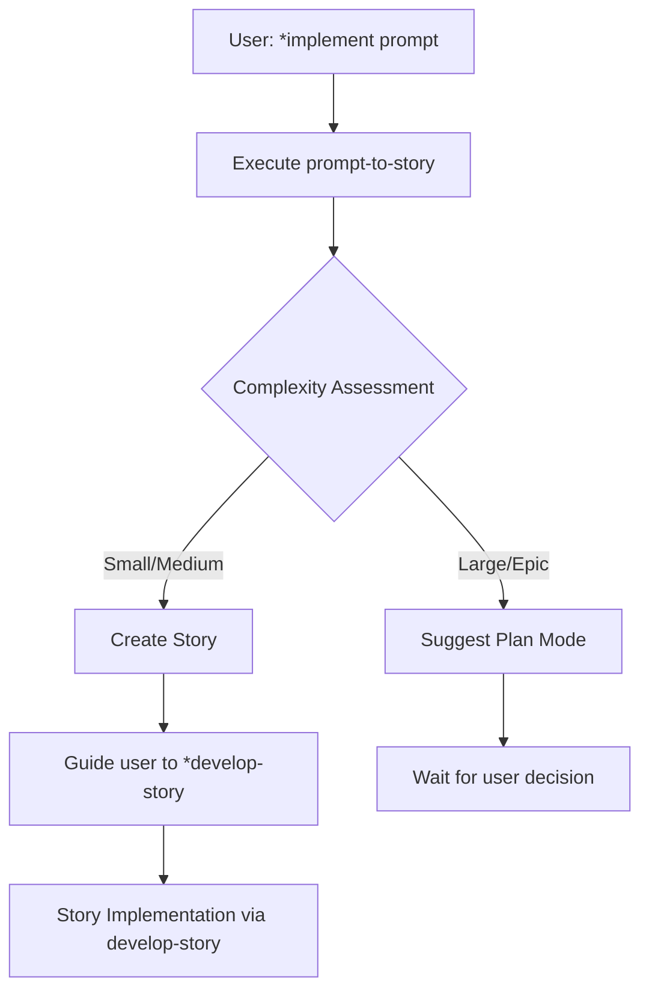

# Implement with Story Workflow Task

## Purpose

Handle the `*implement` command by always creating a story first, then guiding the user to execute it with `*develop-story`. This ensures proper planning, quality gates, and systematic implementation for all changes regardless of size.

## Task Execution Instructions

### 1. Always Start with Story Creation

#### 1.1 Execute Story Creation
- Run the `prompt-to-story` task to convert the user prompt into a proper story
- Follow all prompt analysis and complexity assessment from `prompt-to-story`
- Create implementation-ready story with full context

#### 1.2 Handle Plan Mode Triggers
If the `prompt-to-story` task determines the change is too complex:
- Present the plan mode breakdown as suggested
- Guide user to either refine scope or enter plan mode
- DO NOT proceed with story creation for epic-scope changes

### 2. Post-Story Creation Guidance

#### 2.1 Success Response Format

After successfully creating a story:

```markdown
## ✅ Story Created Successfully

**Story Location**: {{story_file_path}}
**Estimated Effort**: {{hours}} hours
**Complexity**: {{Small/Medium/Large}}

### Next Steps:

**To implement this story, run:**
```
*develop-story
```

**Why use *develop-story instead of direct implementation?**
- ✅ Proper quality gates and testing
- ✅ Systematic task-by-task execution
- ✅ Code review and validation checkpoints
- ✅ Complete documentation of changes
- ✅ Integration with GitHub workflow

**Story Status**: Draft → Ready for Development

**Alternative Commands** (if needed):
- `*review {{story_name}}` - Review story before development
- `*github-branch` - Create feature branch first
- `*run-tests` - Check current test status

**Reminder**: The `*develop-story` command will:
1. Read and implement each task systematically
2. Write appropriate tests for each change
3. Execute validations after each task
4. Update the story with progress tracking
5. Mark story as "Ready for Review" when complete
```

#### 2.2 Plan Mode Response Format

If triggering plan mode:

```markdown
## 🎯 Complex Change Detected - Plan Mode Recommended

{{Include the full plan mode output from prompt-to-story task}}

**Important**: This change is too complex for a single story implementation.

**Recommended Next Steps:**
1. **Enter Plan Mode**: Use Claude Code's plan mode to break this down systematically
2. **Create Epic**: Break into multiple related stories
3. **Refine Scope**: Reduce to a smaller, focused change

**To proceed with plan mode:**
- Ask me to help you plan this step-by-step
- I'll break it into manageable phases with clear checkpoints

**To create smaller scope:**
- Specify which part of this change you'd like to implement first
- I'll create a focused story for that subset
```

### 3. Error Handling and Edge Cases

#### 3.1 Missing Information
If the user prompt lacks critical details:
- Use the interactive refinement process from `prompt-to-story`
- Ask specific clarifying questions
- Do not guess or make assumptions
- Guide user to provide needed context

#### 3.2 Ambiguous Requests
For vague prompts like "make it better" or "fix the issues":
- Ask for specific requirements
- Provide examples of what kinds of changes they might mean
- Guide them to more actionable requests

#### 3.3 Invalid or Impossible Requests
For requests that cannot be implemented:
- Explain why the request cannot be fulfilled
- Suggest alternative approaches if possible
- Guide toward feasible solutions

### 4. Integration with SE Agent Commands

#### 4.1 Relationship to Other Commands

**Replaces**: Direct implementation from `implement-from-prompt`
**Complements**:
- `*create-story` - Same underlying task but with different guidance
- `*develop-story` - The recommended next step after story creation
- `*review` - Optional quality check before development
- `*github-branch` - Optional branch setup before development

#### 4.2 Workflow Integration



### 5. Quality Assurance

#### 5.1 Story Quality Check
Before guiding to `*develop-story`, ensure:
- [ ] Story has clear acceptance criteria
- [ ] Technical approach is feasible
- [ ] Risk factors are identified
- [ ] Scope is appropriate for single story
- [ ] Story is in "Draft" status ready for development

#### 5.2 User Understanding Check
Confirm user understands:
- [ ] Why story creation was necessary
- [ ] How to proceed with `*develop-story`
- [ ] What to expect from the development process
- [ ] Alternative options if they need different approach

### 6. Success Criteria

**Task Successful When:**
- ✅ Appropriate story created from user prompt
- ✅ User guided to correct next step (`*develop-story`)
- ✅ Complex changes properly escalated to plan mode
- ✅ User understands the workflow and rationale
- ✅ Story is ready for systematic implementation

**Task Failed When:**
- ❌ Direct implementation attempted without story creation
- ❌ Complex changes forced into single story
- ❌ User left confused about next steps
- ❌ Story created is not implementation-ready

### 7. Benefits of This Approach

**For Users:**
- Consistent workflow regardless of change size
- Proper planning before implementation
- Quality gates ensure reliable results
- Clear progress tracking through story updates

**For Development:**
- Systematic implementation approach
- Comprehensive testing and validation
- Proper documentation of all changes
- Integration with GitHub workflow

**For Quality:**
- All changes go through same quality process
- Risk assessment before implementation
- Complete test coverage requirements
- Review checkpoints built in

## Implementation Notes

**Key Principle**: Every implementation request should result in a properly planned story that goes through the systematic `*develop-story` workflow. No shortcuts, no direct implementation unless explicitly using specialized tasks for simple fixes.

**User Education**: Help users understand that this workflow, while requiring an extra step, ensures higher quality outcomes and better long-term maintainability of their codebase.