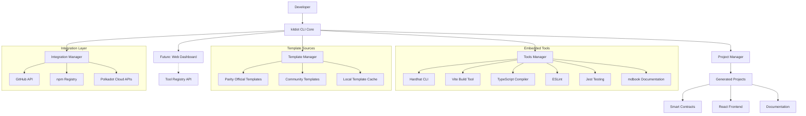
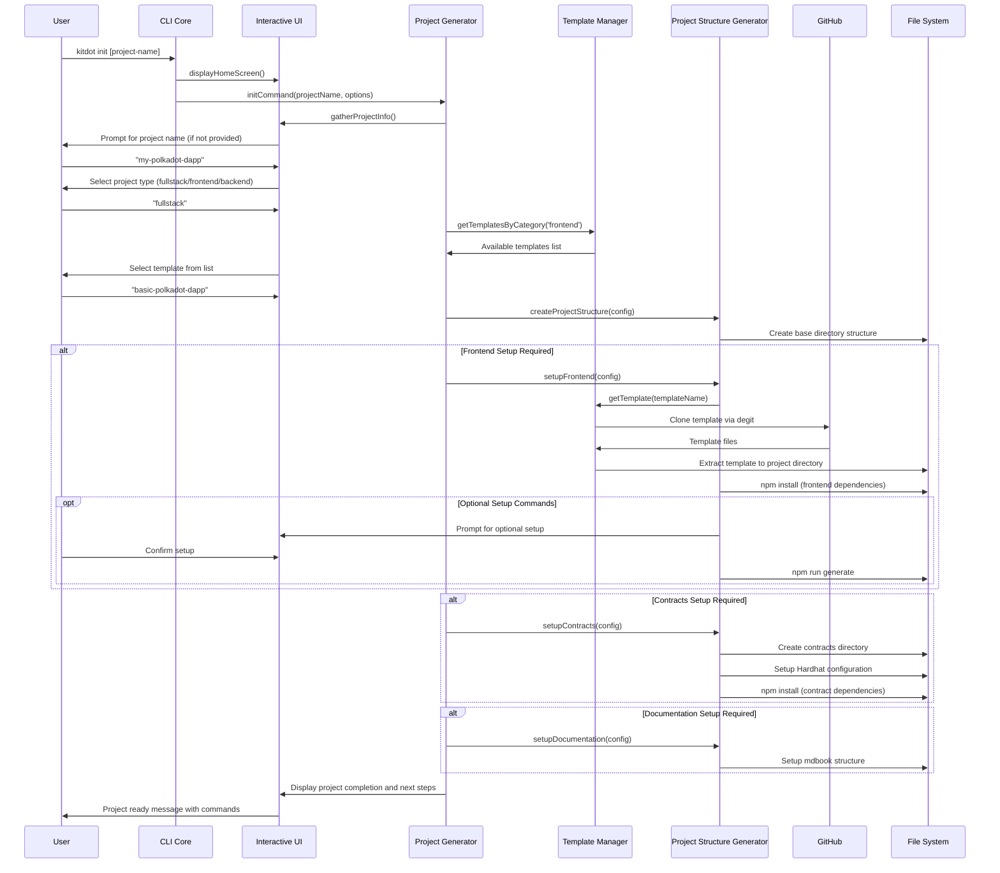
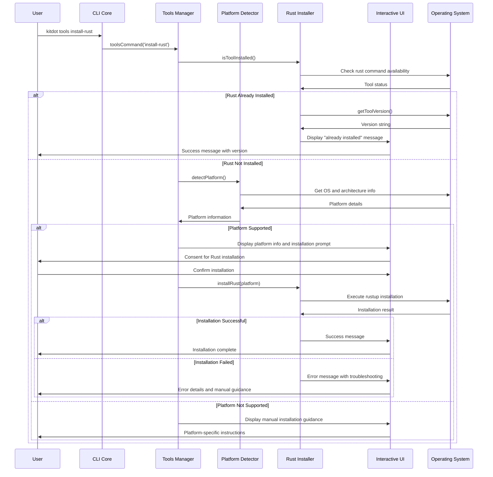
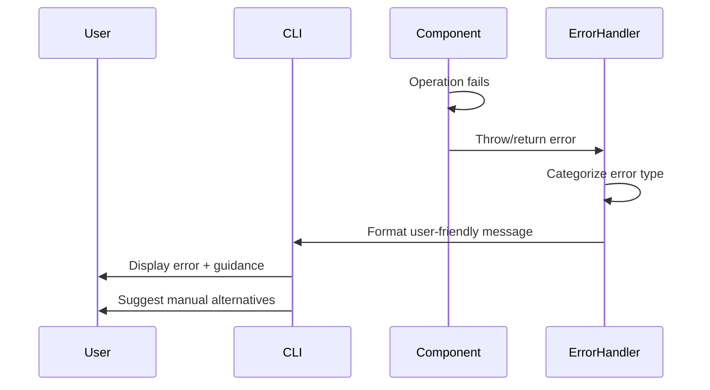

# kitdot Fullstack Architecture Document

## Introduction

This document outlines the complete fullstack architecture for **kitdot**, including backend systems, frontend implementation, and their integration. It serves as the single source of truth for AI-driven development, ensuring consistency across the entire technology stack.

This unified approach combines what would traditionally be separate backend and frontend architecture documents, streamlining the development process for modern fullstack applications where these concerns are increasingly intertwined.

### Starter Template Analysis

**Current State:** kitdot uses official Parity templates (react-solidity-hardhat) and remote GitHub template loading. The project already has:
- Established CLI architecture with TypeScript
- Template validation system
- Integration with existing Polkadot Cloud tooling
- Official Parity template integration

**Architecture Constraints:**
- Must maintain CLI-first approach as primary interface
- Templates loaded remotely from GitHub repositories
- TypeScript throughout the stack for consistency
- Integration with existing Polkadot Cloud tooling

### Change Log

| Date | Version | Description | Author |
|------|---------|-------------|---------|
| 2025-01-17 | 1.0 | Initial fullstack architecture | Winston (Architect) |

## High Level Architecture

### Technical Summary

kitdot follows a **CLI-first tool and template orchestration architecture** that embeds and manages existing development tools alongside standardized project templates. The core system is a Node.js CLI application that serves as a unified interface for multiple embedded tools (Hardhat, Vite, TypeScript compiler, etc.) and remote template sources. The architecture focuses on tool lifecycle management, template discovery/validation, and seamless integration of disparate development toolchains into a cohesive Polkadot Cloud development experience.

### Platform and Infrastructure Choice

**Platform:** Hybrid (npm + GitHub)
**Key Services:** npm registry, GitHub API, degit for template cloning
**Deployment Host and Regions:** Global npm distribution, GitHub global CDN

### Repository Structure

**Structure:** Monorepo with workspace management
**Monorepo Tool:** npm workspaces (simple, built-in)
**Package Organization:**
- Core CLI package as primary entry point
- Shared utilities for template management
- Template validation as separate testable package
- Future packages for enhanced features (web dashboard, etc.)

### High Level Architecture Diagram



### Architectural Patterns

- **Facade Pattern:** kitdot CLI provides unified interface to multiple embedded tools - _Rationale:_ Simplifies complex toolchain interactions into single command interface
- **Adapter Pattern:** Tool-specific adapters normalize different CLI interfaces - _Rationale:_ Enables consistent interaction with Hardhat, Vite, TypeScript, etc.
- **Composite Pattern:** Project structures combine multiple tool outputs and templates - _Rationale:_ Allows complex project generation from multiple sources
- **Proxy Pattern:** Tool execution proxy with logging and error handling - _Rationale:_ Provides consistent UX across different underlying tools
- **Registry Pattern:** Central tool and template registry for discovery and validation - _Rationale:_ Enables extensible tool ecosystem and version management
- **Command Pattern:** Tool operations as discrete, composable commands - _Rationale:_ Enables complex workflows combining multiple tools

## Tech Stack

This is the DEFINITIVE technology selection for the entire kitdot project. Based on the tool orchestration architecture and existing implementation:

### Technology Stack Table

| Category | Technology | Version | Purpose | Rationale |
|----------|------------|---------|---------|-----------|
| CLI Runtime | Node.js | >=18.0.0 | JavaScript runtime for CLI execution | Modern LTS with ESM support, matches existing codebase |
| CLI Language | TypeScript | ^5.6.2 | Type-safe CLI development | Existing choice, enables type safety across tool integrations |
| CLI Framework | Commander.js | ^12.1.0 | Command-line interface structure | Existing choice, mature and well-documented CLI framework |
| Template Engine | degit | ^2.8.4 | Git repository cloning without history | Existing choice, efficient for template fetching from GitHub |
| Process Management | execa | ^9.4.0 | Tool execution and process management | Existing choice, modern process execution with better error handling |
| User Interface | Inquirer.js | ^12.0.0 | Interactive CLI prompts and forms | Existing choice, rich interactive CLI components |
| Progress Feedback | ora | ^8.1.0 | Loading spinners and progress indication | Existing choice, enhances user experience during operations |
| File Operations | fs-extra | ^11.2.0 | Enhanced file system operations | Existing choice, extends Node.js fs with additional utilities |
| Terminal Styling | chalk | ^5.3.0 | Colored terminal output | Existing choice, improves CLI readability and UX |
| Package Distribution | npm | Latest | Global package distribution | Standard for Node.js CLI tools, existing distribution method |
| Embedded Tool: Contracts | Hardhat | Latest | Smart contract development and testing | Industry standard for Ethereum-compatible development |
| Embedded Tool: Frontend | Vite | Latest | Frontend build tool and dev server | Fast, modern build tool for React applications |
| Embedded Tool: Testing | Jest | ^29.7.0 | JavaScript testing framework | Existing choice, comprehensive testing capabilities |
| Embedded Tool: Linting | ESLint | ^9.14.0 | Code quality and style enforcement | Existing choice, maintains code standards |
| Embedded Tool: Docs | mdbook | Latest | Documentation generation | Rust-based documentation tool, integrates with Polkadot ecosystem |
| Template Source | GitHub API | v4 | Remote template repository access | Primary source for Parity and community templates |
| Template Validation | Custom System | 1.0 | Template integrity and compatibility checks | Existing implementation, ensures template quality |
| Build System | TypeScript Compiler | ^5.6.2 | CLI compilation and type checking | Existing choice, compiles TypeScript to JavaScript |
| Monorepo Tool | npm workspaces | Latest | Package management and organization | Simple, built-in solution for monorepo structure |
| CI/CD | GitHub Actions | Latest | Automated testing and publishing | Standard for open source projects |

## Data Models

Based on kitdot's role as a tool and template orchestrator, the core data models represent the entities that the CLI manages and manipulates during project generation and tool integration.

### Template

**Purpose:** Represents a project template that can be fetched, validated, and used for project generation

**Key Attributes:**
- `id`: string - Unique identifier for the template
- `name`: string - Human-readable template name
- `description`: string - Template description and use case
- `source`: TemplateSource - GitHub repo, npm package, or local path
- `version`: string - Template version or git reference
- `type`: ProjectType - fullstack, frontend-only, contracts-only
- `tags`: string[] - Searchable tags for template discovery
- `validatedAt`: Date - Last validation timestamp
- `isOfficial`: boolean - Whether template is Parity-maintained

```typescript
interface Template {
  id: string;
  name: string;
  description: string;
  source: TemplateSource;
  version: string;
  type: ProjectType;
  tags: string[];
  validatedAt: Date;
  isOfficial: boolean;
  requirements: ToolRequirement[];
  metadata: TemplateMetadata;
}
```

**Relationships:**
- Has many ToolRequirement entities
- Belongs to TemplateSource
- Can generate Project entities

### Tool

**Purpose:** Represents an embedded development tool that kitdot can execute and manage

**Key Attributes:**
- `id`: string - Unique tool identifier
- `name`: string - Tool display name
- `executable`: string - Command or binary name
- `version`: string - Required or installed version
- `isEmbedded`: boolean - Whether tool is bundled with kitdot
- `installCommand`: string - Command to install tool if not embedded
- `configFiles`: string[] - Configuration files the tool expects

```typescript
interface Tool {
  id: string;
  name: string;
  executable: string;
  version: string;
  isEmbedded: boolean;
  installCommand?: string;
  configFiles: string[];
  adapters: ToolAdapter[];
  dependencies: ToolDependency[];
}
```

**Relationships:**
- Has many ToolAdapter entities for different operations
- Required by Template entities through ToolRequirement
- Can have ToolDependency relationships with other tools

### Project

**Purpose:** Represents a generated project instance with its configuration and tool setup

**Key Attributes:**
- `name`: string - Project name
- `path`: string - Local file system path
- `templateUsed`: string - Template ID used for generation
- `toolsInstalled`: InstalledTool[] - Tools configured for this project
- `generatedAt`: Date - Project creation timestamp
- `lastModified`: Date - Last modification timestamp
- `config`: ProjectConfig - Project-specific configuration

```typescript
interface Project {
  name: string;
  path: string;
  templateUsed: string;
  toolsInstalled: InstalledTool[];
  generatedAt: Date;
  lastModified: Date;
  config: ProjectConfig;
  structure: ProjectStructure;
}
```

**Relationships:**
- Created from a Template
- Contains multiple InstalledTool entities
- Has one ProjectStructure representing file organization

### ToolAdapter

**Purpose:** Provides unified interface to specific tool operations, abstracting tool-specific command line interfaces

**Key Attributes:**
- `toolId`: string - Reference to parent Tool
- `operation`: string - Operation name (build, test, dev, deploy)
- `command`: string - Actual command to execute
- `args`: string[] - Default arguments for the command
- `workingDirectory`: string - Directory context for execution

```typescript
interface ToolAdapter {
  toolId: string;
  operation: string;
  command: string;
  args: string[];
  workingDirectory: string;
  envVars: Record<string, string>;
  successCriteria: string[];
}
```

**Relationships:**
- Belongs to a Tool entity
- Used by Project operations to execute tool commands

## API Specification

Based on the actual kitdot implementation, here's the accurate API specification for kitdot:

### CLI Command API (Actual Implementation)

```bash
# Core Commands (Actually Implemented)
kitdot init [project-name]           # Initialize new project with interactive prompts
kitdot init [project-name] -d <dir>  # Initialize with custom target directory
kitdot tools install-rust           # Install Rust toolchain for development
kitdot tools check                   # Check development tools status
kitdot tools                         # Show tools help menu
kitdot --version                     # Show version information
kitdot --help                        # Show general help
```

### Internal Module APIs (Based on Actual Types)

```typescript
// Project Configuration (from types.ts)
interface ProjectConfig {
  name: string;
  type: ProjectType;
  directory: string;
  features: ProjectFeatures;
  template?: TemplateConfig;
  platformDetected?: string;
  rustInstalled?: boolean;
  toolInstallConsent?: boolean;
  installRustTools?: boolean;
}

type ProjectType = 'fullstack' | 'frontend' | 'backend';

interface ProjectFeatures {
  contracts: boolean;
  frontend: boolean;
  documentation: boolean;
}

// Template System (from types.ts and registry.ts)
interface TemplateConfig {
  name: string;
  source: TemplateSource;
  path?: string;
}

interface TemplateDefinition {
  name: string;
  description: string;
  framework: string;
  category: 'frontend' | 'fullstack' | 'backend';
  source: TemplateSource;
  features: string[];
  documentationUrl?: string;
  optionalSetup?: OptionalSetupConfig;
  nextSteps?: NextStepsConfig;
}

interface TemplateSource {
  type: 'local' | 'remote';
  repository?: string;
  branch?: string;
  directory?: string;
  localPath?: string;
}

// Template Registry Functions (from registry.ts)
function getTemplatesByCategory(category: 'frontend' | 'fullstack' | 'backend');
function getTemplate(key: string): TemplateDefinition;
```

### Command Implementation APIs

```typescript
// Init Command API (from commands/init.ts)
export async function initCommand(projectName?: string, options?: { dir?: string }): Promise<void>;

// Tools Command API (from commands/tools.ts)
export async function toolsCommand(subcommand?: string): Promise<void>;
// Subcommands: 'install-rust' | 'check' | undefined
```

### Template Registry (Actual Templates)

Current implemented templates:

```typescript
const TEMPLATE_REGISTRY = {
  "basic-polkadot-dapp": {
    name: "Basic Polkadot DApp",
    description: "Official React + Solidity + Hardhat template from Parity Technologies",
    framework: "React",
    category: "fullstack",
    source: {
      type: "remote",
      repository: "paritytech/create-polkadot-dapp",
      branch: "main",
      directory: "templates/react-solidity-hardhat"
    },
    features: ["React", "TypeScript", "Vite", "Tailwind CSS", "Solidity", "Hardhat"]
  },

  "social-login-web3-react": {
    name: "React Web3Auth Social Login",
    description: "React dApp template with Web3Auth social login",
    framework: "React",
    category: "frontend",
    source: {
      type: "remote",
      repository: "w3b3d3v/web3auth-examples",
      branch: "web3dev-version",
      directory: "quick-starts/react-quick-start"
    },
    features: ["React", "Web3Auth", "Social Login", "TypeScript"]
  }
};
```

## Components

Based on the actual kitdot implementation and tool orchestration architecture, here are the major logical components across the system:

### CLI Core

**Responsibility:** Main entry point and command orchestration for kitdot CLI operations

**Key Interfaces:**
- Commander.js command registration and parsing
- Error handling and user feedback coordination
- Version management and help system

**Dependencies:** Commander.js, chalk for styling

**Technology Stack:** TypeScript, Commander.js, Node.js runtime

### Project Generator

**Responsibility:** Orchestrates complete project creation workflow from template selection to dependency installation

**Key Interfaces:**
- `initCommand(projectName?, options?)` - Main project initialization entry point
- `gatherProjectInfo()` - Interactive project configuration collection
- `createProject(config)` - Project creation orchestration

**Dependencies:** Inquirer for user input, ora for progress feedback, Template Registry, Platform Detector

**Technology Stack:** TypeScript with inquirer.js, ora, fs-extra

### Template Manager

**Responsibility:** Template discovery, fetching, validation, and registry management

**Key Interfaces:**
- `getTemplatesByCategory(category)` - Filter templates by project type
- `getTemplate(key)` - Retrieve specific template definition
- Template registry with remote GitHub repository support

**Dependencies:** degit for GitHub repository cloning, fs-extra for file operations

**Technology Stack:** TypeScript, degit, GitHub API integration

### Tools Manager

**Responsibility:** Development tool installation, status checking, and cross-platform management

**Key Interfaces:**
- `toolsCommand(subcommand?)` - Main tools management entry point
- `installRustCommand()` - Rust toolchain installation
- `checkToolsCommand()` - Tool status verification

**Dependencies:** Platform Detector, individual tool installers (RustInstaller)

**Technology Stack:** TypeScript, platform-specific installation scripts, execa for process execution

### Platform Detector

**Responsibility:** Cross-platform environment detection and installation guidance

**Key Interfaces:**
- `detectPlatform()` - Identify OS, architecture, and capabilities
- `getInstallationGuidance(platform)` - Platform-specific setup instructions
- Singleton pattern for consistent platform information

**Dependencies:** Node.js built-in os module, process detection

**Technology Stack:** TypeScript, Node.js platform APIs

### Project Structure Generator

**Responsibility:** File system operations for project scaffolding and directory creation

**Key Interfaces:**
- `createProjectStructure(config)` - Create base project directories
- `setupContracts(config)` - Smart contract project setup
- `setupFrontend(config)` - Frontend application setup
- `setupDocumentation(config)` - Documentation generation

**Dependencies:** fs-extra, template fetching, dependency installation

**Technology Stack:** TypeScript, fs-extra, degit, npm/yarn process execution

### Rust Installer

**Responsibility:** Rust toolchain installation and management for blockchain development

**Key Interfaces:**
- `isToolInstalled()` - Check Rust installation status
- `getToolVersion()` - Retrieve installed Rust version
- `installRust(platform)` - Platform-specific Rust installation
- `getTroubleshootingGuidance()` - Error resolution guidance

**Dependencies:** Platform Detector, execa for rustup execution

**Technology Stack:** TypeScript, rustup.rs integration, cross-platform shell execution

### Interactive User Interface

**Responsibility:** User experience orchestration with prompts, progress feedback, and styled output

**Key Interfaces:**
- Template selection workflows
- Consent and configuration prompts
- Progress spinners and status updates
- Error reporting and troubleshooting guidance

**Dependencies:** inquirer, ora, chalk, homeScreen utility

**Technology Stack:** inquirer.js for prompts, ora for spinners, chalk for terminal styling

## External APIs

Based on the actual kitdot implementation, here are the external service integrations currently used:

### GitHub API

**Purpose:** Remote template repository access for project scaffolding
**Documentation:** https://docs.github.com/en/rest
**Base URL(s):** https://api.github.com, https://github.com (for repository cloning)
**Authentication:** Public repository access (no authentication required for current templates)
**Rate Limits:** 60 requests/hour for unauthenticated requests, 5000/hour for authenticated

**Key Endpoints Used:**
- Repository cloning via `degit` (uses git clone under the hood)
- Template validation through repository structure inspection

**Integration Notes:** kitdot uses `degit` library which handles GitHub repository cloning without git history. Current templates are from public repositories so no authentication is required. Rate limiting primarily affects template discovery operations.

### rustup.rs Installation API

**Purpose:** Cross-platform Rust toolchain installation for blockchain development
**Documentation:** https://rustup.rs/
**Base URL(s):** https://sh.rustup.rs (Unix), https://win.rustup.rs (Windows)
**Authentication:** None required
**Rate Limits:** No documented limits for installation scripts

**Key Endpoints Used:**
- `GET https://sh.rustup.rs` - Unix/Linux installation script
- `GET https://win.rustup.rs/x86_64` - Windows 64-bit installer

**Integration Notes:** kitdot executes platform-specific installation commands through the RustInstaller component. Installation is performed via direct shell execution of rustup scripts. Error handling includes platform-specific troubleshooting guidance.

### npm Registry

**Purpose:** Package dependency management for generated projects
**Documentation:** https://docs.npmjs.com/cli/
**Base URL(s):** https://registry.npmjs.org
**Authentication:** None required for public package installation
**Rate Limits:** No enforced limits for package installation

**Key Endpoints Used:**
- Package installation via `npm install` commands in generated projects
- Dependency resolution through npm CLI

**Integration Notes:** kitdot doesn't directly call npm registry APIs but orchestrates npm commands in generated projects. Template setup includes npm dependency installation for both frontend and contract projects.

## Core Workflows

Based on the actual kitdot implementation, here are the key system workflows illustrated with sequence diagrams:

### Project Initialization Workflow



### Tools Management Workflow



## Database Schema

Based on kitdot's architecture as a CLI tool and template orchestrator, the current implementation does not use a traditional database. However, here's the data persistence and storage strategy:

### File System-Based Data Storage

kitdot uses the local file system for data persistence rather than a traditional database, which aligns with its CLI tool nature:

```plaintext
~/.kitdot/                          # User data directory
├── cache/                          # Template and tool caches
│   ├── templates/                  # Cached template repositories
│   │   ├── basic-polkadot-dapp/    # Cached template files
│   │   └── social-login-web3-react/
│   └── tools/                      # Tool installation artifacts
│       └── rust/                   # Rust installation metadata
├── config/                         # User configuration
│   ├── settings.json               # Global kitdot preferences
│   └── template-registry.json      # Local template registry cache
└── logs/                           # Operation logs
    ├── installations.log           # Tool installation history
    └── projects.log                # Project creation history
```

### Configuration File Schemas

**User Settings Schema (settings.json):**
```json
{
  "version": "0.1.0",
  "preferences": {
    "defaultProjectType": "fullstack",
    "autoInstallDependencies": false,
    "templateCacheEnabled": true,
    "rustToolchainPath": "/path/to/rust"
  },
  "platforms": {
    "detected": "darwin-arm64",
    "supported": true,
    "lastDetected": "2025-01-17T10:30:00Z"
  }
}
```

**Template Registry Cache Schema (template-registry.json):**
```json
{
  "lastUpdated": "2025-01-17T10:30:00Z",
  "templates": {
    "basic-polkadot-dapp": {
      "name": "Basic Polkadot DApp",
      "description": "Official React + Solidity + Hardhat template",
      "category": "fullstack",
      "lastFetched": "2025-01-17T10:25:00Z",
      "validation": {
        "status": "valid",
        "checkedAt": "2025-01-17T10:25:00Z",
        "errors": []
      },
      "source": {
        "type": "remote",
        "repository": "paritytech/create-polkadot-dapp",
        "branch": "main",
        "directory": "templates/react-solidity-hardhat"
      }
    }
  }
}
```

## Frontend Architecture

kitdot's frontend concerns are primarily addressed through template-generated projects rather than a traditional frontend application. Here's how frontend architecture is handled:

### Component Architecture

kitdot doesn't have its own frontend UI but orchestrates frontend project generation. The frontend architecture is defined by the templates it generates:

#### Template-Generated Frontend Structure

```
generated-project/
├── frontend/                       # React application (from templates)
│   ├── src/
│   │   ├── components/            # UI components from template
│   │   │   ├── common/            # Shared components
│   │   │   ├── forms/             # Form components
│   │   │   └── layout/            # Layout components
│   │   ├── pages/                 # Page components/routes
│   │   ├── hooks/                 # Custom React hooks
│   │   ├── services/              # API client services
│   │   ├── stores/                # State management
│   │   ├── styles/                # Global styles/themes
│   │   └── utils/                 # Frontend utilities
│   ├── public/                    # Static assets
│   └── package.json               # Frontend dependencies
```

#### Component Template Pattern (Generated by Templates)

Based on the actual templates in the registry, here's the typical component structure:

```typescript
// Generated by basic-polkadot-dapp template
import React from 'react';
import { useAccount, useBalance } from 'wagmi';

interface WalletComponentProps {
  className?: string;
}

export const WalletComponent: React.FC<WalletComponentProps> = ({
  className
}) => {
  const { address, isConnected } = useAccount();
  const { data: balance } = useBalance({ address });

  return (
    <div className={className}>
      {isConnected ? (
        <div>
          <p>Connected: {address}</p>
          <p>Balance: {balance?.formatted} {balance?.symbol}</p>
        </div>
      ) : (
        <p>Please connect your wallet</p>
      )}
    </div>
  );
};
```

## Backend Architecture

kitdot's backend is the CLI tool itself, designed as a Node.js application with modular service architecture:

### Service Architecture

**CLI Application Pattern** - Single-threaded Node.js application with command-based architecture:

```
src/
├── cli.ts                         # Main CLI entry point
├── commands/                      # Command handlers
│   ├── init.ts                   # Project initialization
│   └── tools.ts                  # Tools management
├── tools/                        # Tool management services
│   ├── platform-detector.ts     # OS/architecture detection
│   └── rust-installer.ts        # Rust toolchain management
├── utils/                        # Utility services
│   ├── project-structure.ts     # File system operations
│   ├── setup-contracts.ts       # Contract scaffolding
│   ├── setup-frontend.ts        # Frontend scaffolding
│   └── setup-docs.ts            # Documentation setup
├── templates/                    # Template management
│   └── registry.ts              # Template registry and fetching
└── types.ts                     # Shared type definitions
```

## Unified Project Structure

Based on kitdot's CLI-first architecture with npm workspaces:

```
kitdot/
├── .github/                       # CI/CD workflows
│   └── workflows/
│       ├── ci.yml                # Test and build pipeline
│       └── publish.yml           # npm publishing workflow
├── src/                          # CLI source code
│   ├── cli.ts                   # Main CLI entry point
│   ├── commands/                # Command implementations
│   ├── tools/                   # Tool management
│   ├── utils/                   # Utility functions
│   ├── templates/               # Template registry
│   └── types.ts                 # Type definitions
├── dist/                         # Compiled JavaScript output
├── test/                         # Test suites
│   ├── template-validation.test.ts
│   └── platform-detection.test.ts
├── templates/                    # Local template storage (if any)
├── docs/                         # Documentation
│   ├── architecture.md          # This document
│   ├── prd.md                   # Product requirements
│   └── ui-architecture.md       # Frontend guidance
├── .env.example                  # Environment template
├── package.json                  # Main package configuration
├── tsconfig.json                 # TypeScript configuration
├── jest.config.js                # Testing configuration
├── .eslintrc.js                  # Code quality rules
└── README.md                     # Project documentation
```

## Development Workflow

### Local Development Setup

```bash
# Prerequisites
node --version    # >= 18.0.0
npm --version     # Latest
git --version     # Latest
```

```bash
# Initial Setup
git clone https://github.com/your-org/kitdot
cd kitdot
npm install
npm run build
npm link         # Install globally for testing
```

```bash
# Development Commands
npm run dev      # Start development with tsx
npm run build    # Compile TypeScript to JavaScript
npm run test     # Run all tests
npm run lint     # Check code quality
npm run lint:fix # Fix linting issues
```

### Environment Configuration

```bash
# Development (.env)
NODE_ENV=development
LOG_LEVEL=debug

# Production (.env)
NODE_ENV=production
LOG_LEVEL=info
```

## Deployment Architecture

### Deployment Strategy

**CLI Distribution:**
- **Platform:** npm registry for global installation
- **Build Command:** `npm run build`
- **Output Directory:** `dist/`
- **Distribution Method:** npm package publication

**Release Process:**
- **Platform:** GitHub Actions for automated releases
- **Build Command:** Automated on tag push
- **Deployment Method:** npm publish with CI/CD

### CI/CD Pipeline

```yaml
# .github/workflows/ci.yml
name: CI/CD Pipeline
on: [push, pull_request]
jobs:
  test:
    runs-on: ubuntu-latest
    steps:
      - uses: actions/checkout@v3
      - uses: actions/setup-node@v3
        with:
          node-version: '18'
      - run: npm ci
      - run: npm test
      - run: npm run lint
      - run: npm run build
```

### Environments

| Environment | CLI Install | Purpose |
|-------------|-------------|---------|
| Development | `npm link` (local) | Local development and testing |
| Staging | `npm install -g kitdot@beta` | Pre-release testing |
| Production | `npm install -g kitdot` | Global distribution |

## Security and Performance

### Security Requirements

**CLI Security:**
- Input Validation: All user inputs validated against injection attacks
- File System Access: Restricted to user-specified directories only
- Network Requests: Limited to trusted domains (GitHub, rustup.rs)

**Template Security:**
- Template Validation: All templates validated before execution
- Remote Fetching: Only from approved repositories
- Dependency Installation: User consent required for all installations

### Performance Optimization

**CLI Performance:**
- Startup Time Target: < 2 seconds for command initialization
- Template Caching: Local cache for faster subsequent operations
- Parallel Operations: Concurrent template fetching and validation

**Resource Management:**
- Memory Usage: Efficient streaming for large template downloads
- Network Usage: Resume capabilities for interrupted downloads
- Disk Usage: Automatic cleanup of temporary files

## Testing Strategy

### Testing Pyramid

```
    E2E Tests (CLI Integration)
   /                           \
  Unit Tests (Components)    Integration Tests (Templates)
```

### Test Organization

```
test/
├── unit/                         # Component unit tests
│   ├── tools/
│   │   ├── platform-detector.test.ts
│   │   └── rust-installer.test.ts
│   └── utils/
│       └── project-structure.test.ts
├── integration/                  # Template integration tests
│   ├── template-validation.test.ts
│   └── project-generation.test.ts
└── e2e/                         # End-to-end CLI tests
    ├── init-command.test.ts
    └── tools-command.test.ts
```

## Coding Standards

### Critical CLI Rules

- **Error Handling:** All external operations must include comprehensive error handling with user guidance
- **User Consent:** Tool installations and optional operations require explicit user consent
- **Cross-Platform:** All file system operations must work on Windows, macOS, and Linux
- **Input Validation:** Validate all user inputs against injection and path traversal attacks
- **Progress Feedback:** Long-running operations must provide progress feedback to users
- **Graceful Degradation:** Provide manual alternatives when automated operations fail

### Naming Conventions

| Element | Convention | Example |
|---------|------------|---------|
| Commands | kebab-case | `init`, `tools` |
| Files | kebab-case | `platform-detector.ts` |
| Classes | PascalCase | `RustInstaller` |
| Functions | camelCase | `createProject` |
| Constants | UPPER_SNAKE_CASE | `TEMPLATE_REGISTRY` |

## Error Handling Strategy

### Error Flow



### Error Response Format

```typescript
interface CLIError {
  code: string;
  message: string;
  userGuidance: string;
  troubleshootingUrl?: string;
  platform?: string;
}
```

## Monitoring and Observability

### Monitoring Stack

- **CLI Monitoring:** Local logging to ~/.kitdot/logs/
- **Error Tracking:** Console output with structured error messages
- **Performance Monitoring:** Operation timing in development mode
- **Usage Analytics:** Optional anonymous usage statistics (with user consent)

### Key Metrics

**CLI Performance:**
- Command execution time
- Template download speed
- Tool installation success rate
- Cross-platform compatibility rate

**User Experience:**
- Command completion rate
- Error frequency by platform
- Template usage patterns
- Tool installation preferences