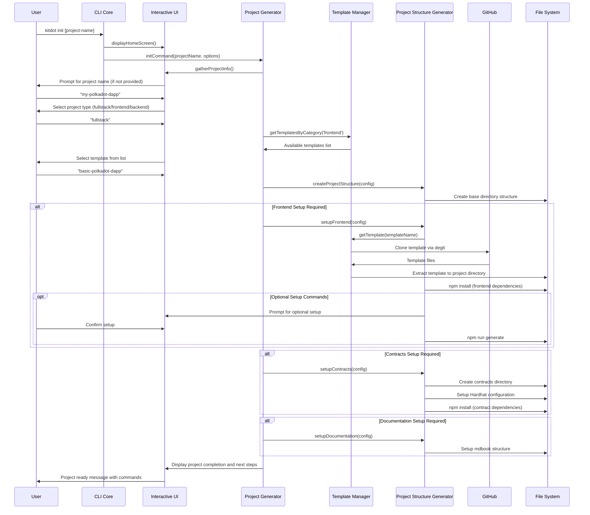
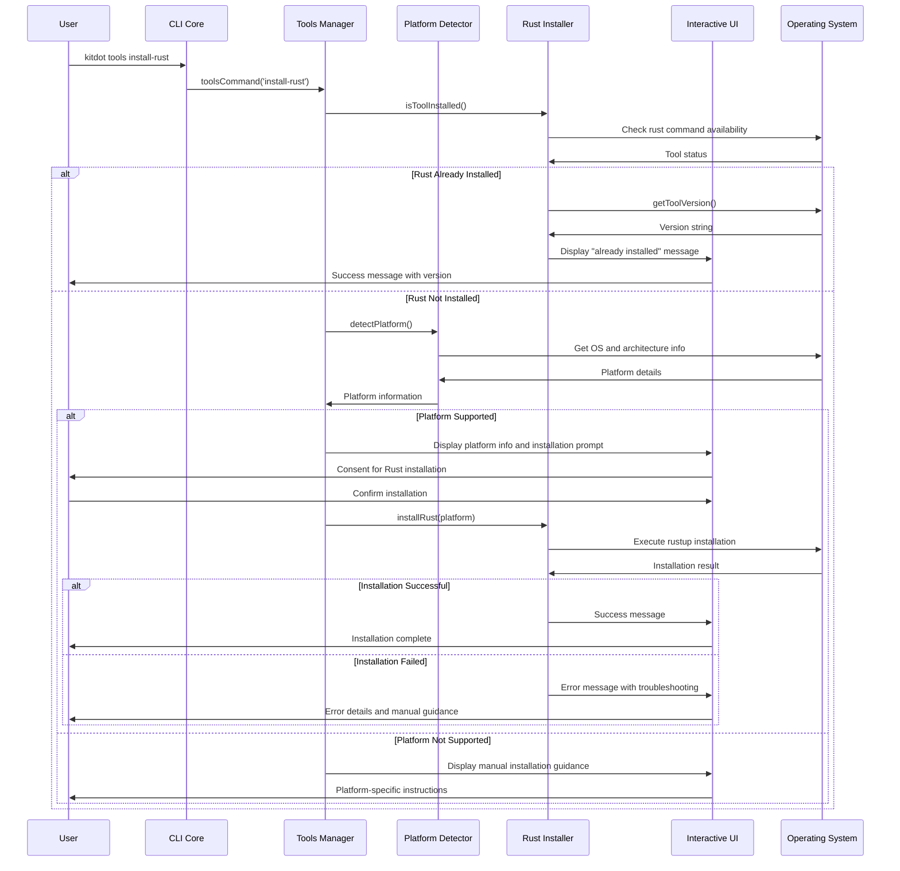

# Core Workflows

Based on the actual kitdot implementation, here are the key system workflows illustrated with sequence diagrams:

## Project Initialization Workflow

## Tools Management Workflow

