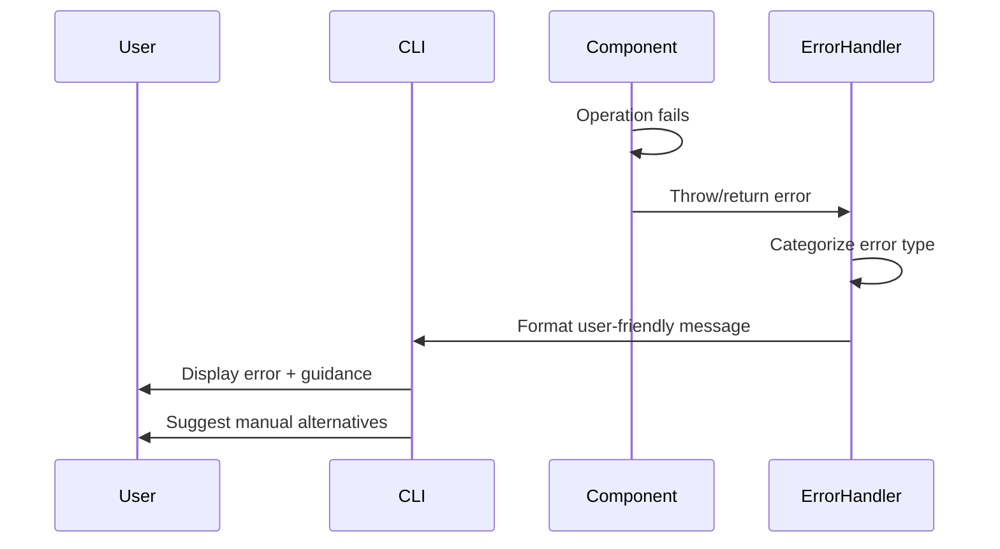

# Error Handling Strategy

## Error Flow



## Error Response Format

```typescript
interface CLIError {
  code: string;
  message: string;
  userGuidance: string;
  troubleshootingUrl?: string;
  platform?: string;
}
```
