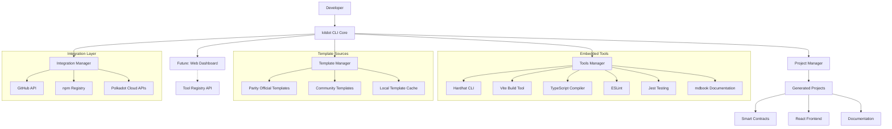

# High Level Architecture

## Technical Summary

kitdot follows a **CLI-first tool and template orchestration architecture** that embeds and manages existing development tools alongside standardized project templates. The core system is a Node.js CLI application that serves as a unified interface for multiple embedded tools (Hardhat, Vite, TypeScript compiler, etc.) and remote template sources. The architecture focuses on tool lifecycle management, template discovery/validation, and seamless integration of disparate development toolchains into a cohesive Polkadot Cloud development experience.

## Platform and Infrastructure Choice

**Platform:** Hybrid (npm + GitHub)
**Key Services:** npm registry, GitHub API, degit for template cloning
**Deployment Host and Regions:** Global npm distribution, GitHub global CDN

## Repository Structure

**Structure:** Monorepo with workspace management
**Monorepo Tool:** npm workspaces (simple, built-in)
**Package Organization:**
- Core CLI package as primary entry point
- Shared utilities for template management
- Template validation as separate testable package
- Future packages for enhanced features (web dashboard, etc.)

## High Level Architecture Diagram

## Architectural Patterns

- **Facade Pattern:** kitdot CLI provides unified interface to multiple embedded tools - _Rationale:_ Simplifies complex toolchain interactions into single command interface
- **Adapter Pattern:** Tool-specific adapters normalize different CLI interfaces - _Rationale:_ Enables consistent interaction with Hardhat, Vite, TypeScript, etc.
- **Composite Pattern:** Project structures combine multiple tool outputs and templates - _Rationale:_ Allows complex project generation from multiple sources
- **Proxy Pattern:** Tool execution proxy with logging and error handling - _Rationale:_ Provides consistent UX across different underlying tools
- **Registry Pattern:** Central tool and template registry for discovery and validation - _Rationale:_ Enables extensible tool ecosystem and version management
- **Command Pattern:** Tool operations as discrete, composable commands - _Rationale:_ Enables complex workflows combining multiple tools
